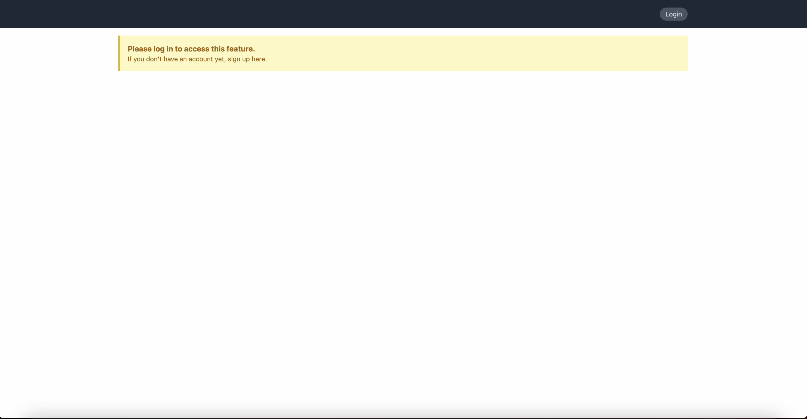

# Momapix

Per lo svolgimento della prova pratica richiesta sono state implementate le seguenti componenti:

- **Moma Frontend**, ossia un semplice client scritto in Angular che consente di eseguire le seguenti operazionie:

  - login/logout
  - search item
  - view item
  - download item. Nota: la funzione di download è abilitata solo per l'item "moonlight" e, nonostante sia stata implementata come descritto nella documentazione tecnica, pur ottenendo un codice di risposta HTTP 200 all'esecuzione del download viene restituito un errore (che per completezza viene mostrato in un alert javascript)

- **Moma Proxy**, ossia un semplice proxy implementato in Nodejs che ha il compito di proxare le chiamate fatte da **Moma Frontend** verso le  Momapix API. Tale componente è necessaria per bypassare le Preflight request effettuate dal Browser al momento della sottomissione delle richieste.
  - https://prova.momapix.com/rest/search/items?<query parametes>
  - https://prova.momapix.com/rest/items/
  - https://prova.momapix.com/rest/session
  - https://prova.momapix.com/rest/session/login
  - https://prova.momapix.com/rest/session/logout
  - https://prova.momapix.com/rest/download

## Teconlogie utilizzate

- Angular 15 (https://angular.io/docs)
- Nodejs 18.14.2 LTS (https://nodejs.org/it/)
- Tailwindcss (https://tailwindcss.com/)
- Docker (https://www.docker.com/products/docker-desktop/)

## Istruzioni per l'installazione e l'avvio

1. Installare Docker/Docker desktop (se necessario)
2. Avviare Docker/Docker desktop
3. Posizionarsi all'interno della root di progetto `<root>/momapix-demo` (es `cd /users/your-home-directory/momapix-demo`)
4. Eseguire il comando `docker-compose up`
5. Al termine della preparazione dei container Docker avvierà l'applicazione su http://localhost:4200

## Extra

## Considerazioni finali e migliorie future
Per ragioni di rapidità alcuni dettagli non sono stati implementati. Per completare l'esercizio sarebbe opportuno:
- integrare uno state manager per la gestione della sessione utente
- implementare la paginazione delle immagini mostrate nella Gallery
- implementare un handler per la gestione e la visualizzazione degli errori
